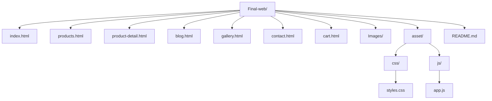

# Garlic Mart — Final Web Project

Garlic Mart is a multi-page e-commerce demo website built using HTML, CSS, and JavaScript.

This project was created by Kha Dao to practice core frontend development skills including dynamic rendering,
localStorage, UI components, and client-side form validation.  
The idea for the project comes from my mom's business, which sells garlic products.

---

## Technologies Used

- HTML5 (Semantic structure)
- CSS3 (Flexbox, Grid, Responsive Design)
- Vanilla JavaScript (No frameworks)
- LocalStorage (Cart persistence)
- Basic Accessibility (ARIA, focus trap, skip link)

---

## Project Structure



---

## Features

### Business Features

#### Product Browsing

- Users can view a list of garlic products
- Product cards include image, description, and price
- Search products by name or tag
- Filter products by price range
- Sort products by price or name

#### Product Details

- Dedicated product detail page
- Quantity selection
- Product specification table
- Tooltip hints
- Modal popup showing additional information

#### Shopping Cart

- Add products to cart
- Edit quantity inside the cart
- Remove individual items
- Clear entire cart
- Automatic price calculation
- Cart item counter displayed in navigation

#### Image Gallery

- Display garlic product images
- Hover zoom effect

#### Contact / Order Form

- Users can send inquiries or place orders
- Form includes:
    - Name
    - Email
    - Topic
    - Message
    - Agreement checkbox

Form validation ensures:

- Name must have at least 2 characters
- Email must be valid
- Message must contain at least 10 characters
- User must accept the terms

---

### Technical Features

#### Dynamic Rendering

- Product list generated dynamically using JavaScript
- Product detail page generated based on URL parameters
- Cart table dynamically updated

#### LocalStorage Cart System

- Cart data stored in browser localStorage
- Cart persists across page reloads
- Quantity updates automatically recalculate totals

#### UI Components

- Toast notifications
- Modal dialogs
- Tooltip hints

#### Form Validation

- Email validation using regex
- Field-level error messages
- Prevent submission when input is invalid

#### URL Parameter Handling

```
new URLSearchParams(location.search)
```

Used to retrieve product IDs and dynamically display product data.

---

## Accessibility

Basic accessibility improvements were implemented:

- Skip to content link
- aria-current navigation indicator
- aria-label usage
- aria-live toast notifications
- Focus trap inside modal dialogs

---

## Responsive Design

The website adapts to different screen sizes using:

- Flexbox for layout and navigation
- CSS Grid for product cards
- Responsive spacing and layout adjustments

---

## Learning Objectives Achieved

Through this project, the following frontend skills were practiced:

- Creating a multi-page website
- Separating HTML, CSS, and JavaScript
- Managing application state using localStorage
- Rendering UI dynamically with JavaScript
- Implementing client-side form validation
- Building reusable UI components (Toast, Modal)
- Structuring a small frontend project

---

## How to Run the Project

### Option 1

Open `index.html` directly in a web browser.

### Option 2 (Recommended)

Use a local development server such as:

- Live Server (VS Code extension)
- WebStorm built-in server

---

## Possible Future Improvements

- Checkout page
- Discount code system
- Shipping cost calculation
- Dark mode toggle
- Product pagination
- Backend integration (NodeJS / Firebase / PHP)

---

## Author

Kha Dao

Educational project created to practice frontend web development.